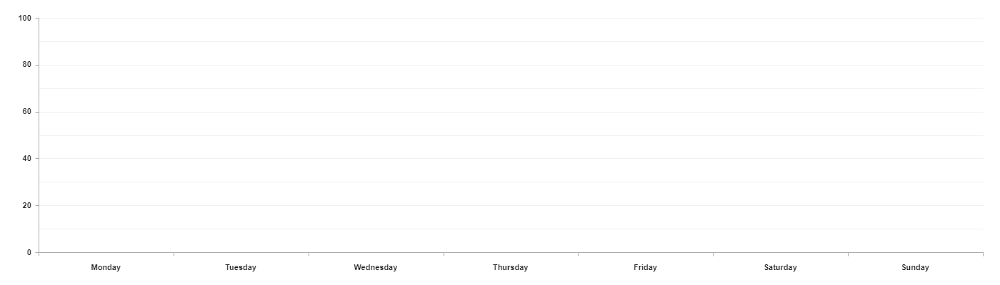

# GraphJS
# Documentation is not fully redy yet

* [About](#about)
* [Installation](#installation)
* [Example](#example)
* [Documentation](#documentation)
* [Links](#)

# About {#about}

GraphJS is javascript library to create flexible graphs. It uses pure javascript to draw charts on canvas.

# Installation {#installation}

```bash
    npm install web-graphs
```

# Example {#example}

**Code**

```HTML
    <canvas width="1400" height="700"></canvas>
```

```typescript
    const canvas = document.querySelector('canvas');

    let grid = new CoordinateSystem2dGrid(canvas, {
        x: new ValueLabel(-100, 100, 50),
        y: new FlexLabel(100, 0, 20)
    });

    grid.addCharts({
        line: new LineChart({
            fill: true,
            dots: true,
            smooth: true,
            values: [{
                color: ['#005B80', '#00B6FF'],
                values: [25, 70, 65, 50, 30]
            }, {
                color: ['#FF00AA', '#800055'],
                values: [[-30, -60, -40, -70], [-16 , -10, -40], [-70, -65, -65, -100, -90], [-70, -75, -85], -70]
            }]
        })
    });
    grid.draw();
}
```

**Output**


# Documentation {#documentation}


* [Labels](#)
* [Grids](#)
* [Charts](#)
* [Factors](#)

## Labels

### **String label**
It will create named ranges.

* **values** - array of names
* **reverse** - reverses direction of label

**Code**
```typescript
    StringLabel(values: string[], {reverse?: boolean} = {});

    let label = new StringLabel(['Monday', 'Tuesday', 'Wednesday', 'Thursday', 'Friday', 'Saturday', 'Sunday']);
    let label = new StringLabel(['Monday', 'Tuesday', 'Wednesday', 'Thursday', 'Friday', 'Saturday', 'Sunday'], {reverse: true});
```

**Output**


### **Value label**
It is using to determinate points how the charts should be draw.

* **start** - first number of label
* **end** - last number of label
* **step** - step to next number
* **reverse** - reverses direction of label

**Code**
```typescript
    ValueLabel(start: number, end: number, step: number, {reverse?: boolean} = {});

    let label1 = new ValueLabel(-100, 100, 50);
    let label2 = new ValueLabel(100, -100, 25);
    let label3 = new ValueLabel(100, -80, 20, {reverse: true});
```

**Output**


### **Flex label**
It is same thing as ValueLabel but it will automativly change its start, end and step according to charts values.

* **start** - first number of label
* **end** - last number of label
* **step** - step to next number

**Code**
```typescript
    FlexLabel(start: number = 0, end: number = 100, step: number = 20);

    let label1 = new FlexLabel();
    let label2 = new FlexLabel(-100, 100, 50);
    let label3 = new FlexLabel(100, -100, 25);
```

**Output**


### **Percent label**
It is using to determinate points how the charts should be draw. It takes values from 0 to 100.

* **step** - step to next number
* **reverse** - reverses direction of label

**Code**
```typescript
    PercentLabel(step: number, {reverse?: boolean} = {});

    let label = new PercentLabel(20);
    let label = new PercentLabel(20, {reverse: true});
```

**Output**


## Grids

### HorizontalGrid

Creates 2d plane with values/string labels.

* **canvas** - html canvas element
* **top right bottom left** - direction labels
* **mainLabel** - Grid will be draw by this label. Moreover all charts will be coresponding to this label. Default 'left'. It can not be StringLabel
* **secondaryLabel** - By this label charts will be signed. It must be StringLabel
* **factor** - <a>more about facotrs</a>

**Code**
```typescript
    HorizontalGrid(canvas: HTMLCanvasElement, {
        top?: Label,
        right?: Label,
        bottom?: Label,
        left?: Label
    }, {
        mainLabel?: 'left' | 'right',
        secondaryLabel?: 'bottom' | 'top',
        factor?: GridFactor
    } = {});

    let grid1 = new HorizontalGrid(canvas, {
        top: new StringLabel(['Monday', 'Tuesday', 'Wednesday', 'Thursday', 'Friday', 'Saturday', 'Sunday'], {reverse: true}),
        left: new PercentLabel(25),
        bottom: new StringLabel(['Monday', 'Tuesday', 'Wednesday', 'Thursday', 'Friday', 'Saturday', 'Sunday']),
        right: new FlexLabel()
    });

    let grid2 = new HorizontalGrid(canvas, {
        left: new ValueLabel(100,0, 20),
        bottom: new StringLabel(['Monday', 'Tuesday', 'Wednesday', 'Thursday', 'Friday', 'Saturday', 'Sunday']),
    });
```

**Output**

<!-- <section class="img-box"> -->


<!-- </section> -->
### VerticalGrid
### CoordinateSystem2dGrid
### CoordinateSystem1dGrid
### PolygonGrid
### NoGrid 